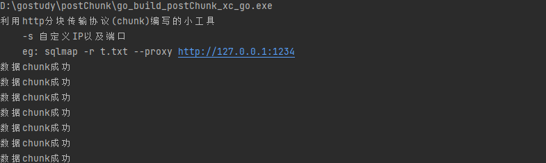
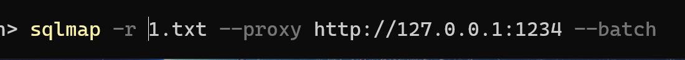
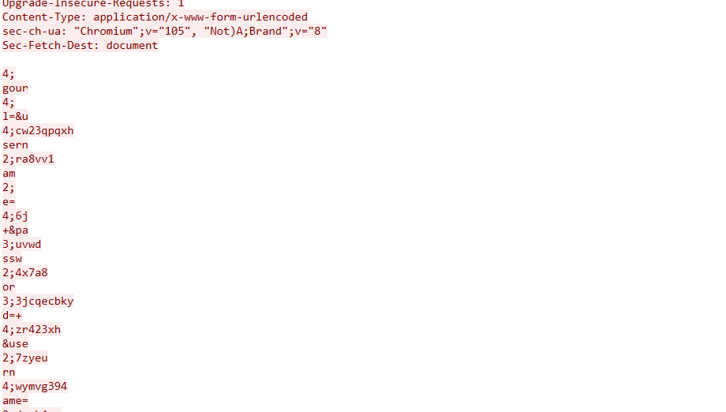
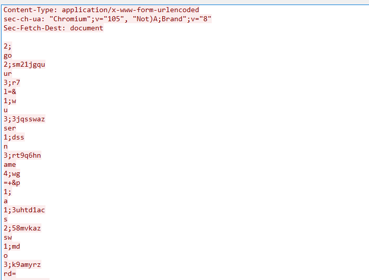

# postChunk
小工具   使用http协议的分块传输进行代理工具   可用于sqlmap bypass waf

postChunk-xc.go 协程版本 建议使用该版本

postChunk.go 单线程版本

使用`go build  postChunk-xc.go`  编译
## 使用说明
 开启监听
    ./postChunk-xc.exe

 默认监听端口是1234

 不知道什么360会报毒

使用sqlmap 设置代理

    sqlmap -r 1.txt --proxy http://127.0.0.1:1234

测试

